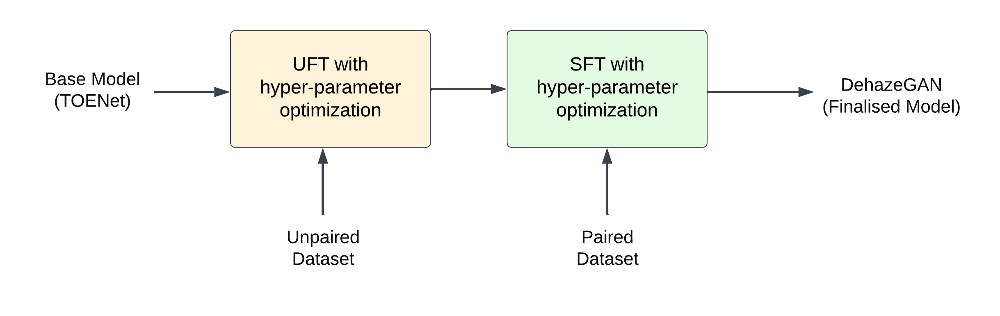
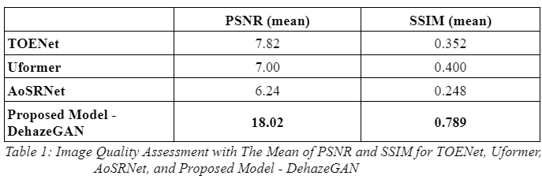
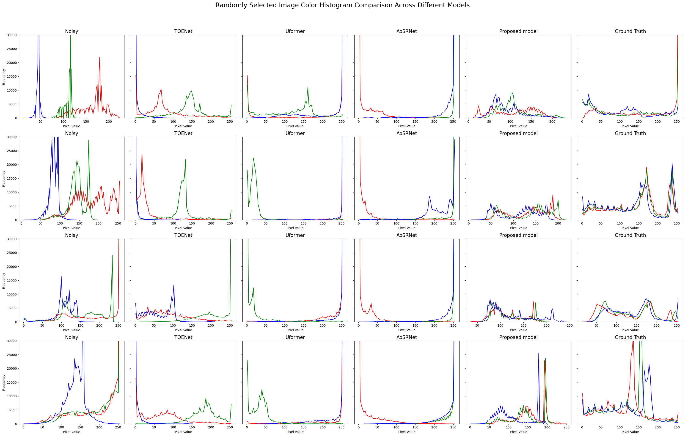

# DehazeGAN: Sand-Dust Image Restoration using Semi-supervised Adversarial Learning
## About The Project
Removing color cast for image restoration in sand and dust conditions is essential for improving the accuracy and performance of outdoor computer vision systems. Enhancements in this area are crucial for environments heavily impacted by sand and dust, where visibility and image quality are significantly degraded. Despite so, only few deep learning models are published to denoise and remove color cast from sandstorm images.

Therefore, we propose a novel deep-learning model extended from TOENet (Gao et al., 2023), DehazeGAN to remove color cast from sandstorm images through unsupervised fine-tuning (UFT) using adversarial learning and supervised fine-tuning (SFT) via paired augmentation.

## Getting Started
### Installation Prerequisites
We developed and tested our application using the following configurations. 
- OS: Linux Ubuntu 22.04
- Python Version: 3.10
- Nvidia Driver Version: 545.29.06
- Nvidia CUDA Tool-kit Version: 12.0.1 

Currently, our project only supports device with GPU. If your device does not have GPU, please consider using cloud services or remote desktop with GPU.

#### NCCL Installation
This installation only applies to devices with GPU. For remote desktop please read the **Anydesk Installation** Section below.
1. Open a terminal window.
2. Verify you have nvidia driver installed with the command ```nvidia-smi```. 
3. If you see an error in the above command, please install a NVIDIA driver from the command line. Note that we used the driver version of 545.29.06.  
```sh
sudo ubuntu-drivers install nvidia:545
```
4. We also need CUDA-toolkit. Verify it by using the command ```nvcc --version```. 
5. If you see an error in the above command, please install CUDA toolkit with following commands. We use version 12.0.
- Get the executable required: 
```sh
wget https://developer.download.nvidia.com/compute/cuda/12.0.1/local_installers/cuda_12.0.1_525.85.12_linux.run
```
- Run the executable to install the kit: 
```sh
sudo sh cuda_12.0.1_525.85.12_linux.run
```
6. Finally, install NCCL using 
```sh
sudo apt get libnccl2
```

#### Anydesk Installation
This installation applies to device that does not have GPU. In this case, you need to have a remote desktop with GPU to run it.
1. Download the installer for Anydesk (targeted to your platform) from https://anydesk.com/en/downloads. 
2. Open the executable and enter the appropriate remote address and its password. Make sure the host desktop has the specifications as mentioned in Installation Prerequisites above.

## Running the Web Application
After you ensure that you meet all the Installation Prerequisites above, please follow these steps to run the application.
1. In the terminal, clone a repository for our project from GitHub using git command 
```sh
git clone https://github.com/superleesa/final_year_project.git
```
2. Go to the repository directory and install Python libraries required for the app, using the command 
```sh
pip install -r requirements.txt.
```
3. Run the flask application using the command ```python app/app.py``` or ```python3.10 app/app.py```.
4. In a browser, go to http://localhost:5000/ and you should see our application UI.

## Training Guidelines
For training of the dataset, we would need to download the SIE Dataset. The paper on the SIE Dataset can be found here: [LINK](https://link.springer.com/article/10.1007/s00371-022-02448-8). The SIE Dataset should be downloaded to the ```Data``` folder, in the format of the Data DIrectory Structure below.

### Data Directory Structure
```
Data/
└── paired/
|   ├── ground_truth/
|   │   ├── ...
|   │   ├── ...
|   │   └── ...
|   └── noisy/
|       ├── ...
|       ├── ...
|       └── ...
└── unpaired/
    ├── clear/
    │   ├── ...
    │   ├── ...
    │   └── ...
    └── noisy/
        ├── ...
        ├── ...
        └── ...

```
### Training of Model
We follow the training pipeline as illustrated below:


#### Unsupervised Finetuning Training (UFT)
1. Open the terminal.
2. Navigate to the directory of UFT using command ```cd train/uft```
3. Run the command ```python unpaired_train.py```.
4. The model would be stored in xxx.

#### Supervised Finetuning Training (SFT)
1. Open the terminal.
2. Navigate to the directory of SFT using command ```cd train/sft/toenet_base```
3. Run the command ```python paired_train.py```.
4. THe model would be stored in xxx.

## Evaluation Guidelines
After the training of the model, we could evaluate the performance of the model using metrics such as PSNR and SSIM.
1. Open the terminal.
2. Navigate to the directory of evaluation using command ```cd evaluation```
3. Run the command ```python eval.py```.
4. The output of the average of the metrics would be stored in a yaml file in the save directory.

## Results
### Metrics Comparison with the Other Models


### Color Histogram Comparison with Other Models


## Acknowledgements
The base model of our project is based on the [TOENet] (https://github.com/YuanGao-YG/TOENet).


